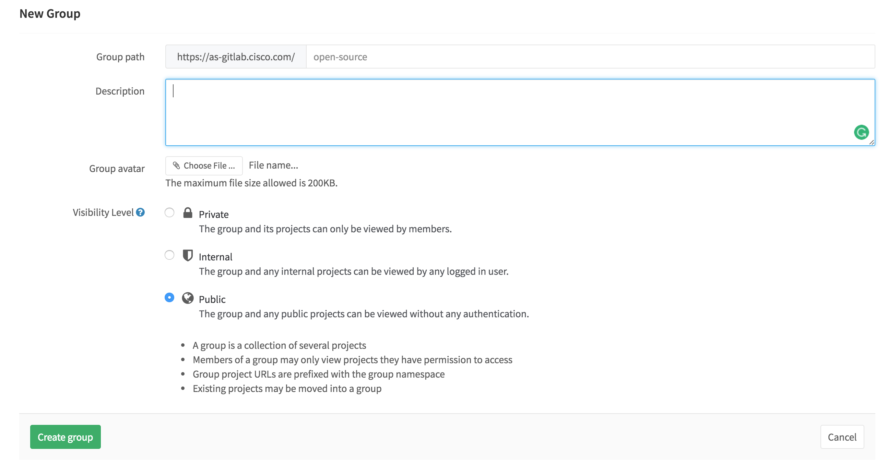

Group
=====

A Group is a collection of projects and all the projects in the same group are under the same namespace. If you already (or will) have more than one related git repository, please group them together
and treat them as a group.

More information about group like memeber management can get from the screenshot below.

