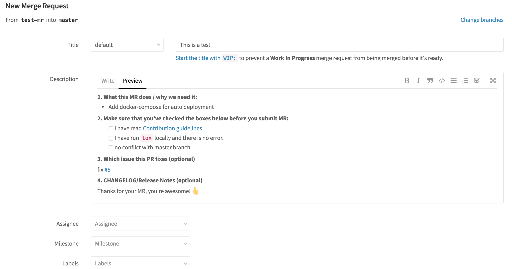
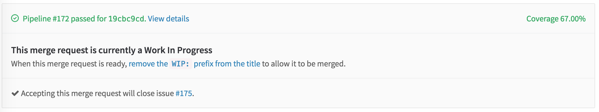

Merge Request
=============

Branch should be merged to master when you have finished some work, for example, you have fixed an issue or implemented a feature. You can create `Merge Request` in GitLab, and
assign it to somebody in your team. Actually, you also can create a merge request which is working in progress.

You can create a MR by yourself, or use the templates.

Templates
----------

There are issue template and merge request template. How to create merge request template? Just like issue template, you should create a markdown file in your git repository.
The location should be in `project_folder/.gitlab/merge_request_templates/xxx.md`, `xxx` will be the name of the template.

Here is what a template look like [#f1]_ .

.. code-block:: bash

  $ more .gitlab/merge_request_templates/default.md
  **1. What this MR does / why we need it:**

  -
  -

  **2. Make sure that you've checked the boxes below before you submit MR:**

  - [ ] I have read [Contribution guidelines](https://gitlab.com/test/demo/blob/master/CONTRIBUTING.md)
  - [ ] I have run `tox` locally and there is no error.
  - [ ] no conflict with master branch.

  **3. Which issue this PR fixes (optional)**

  **4. CHANGELOG/Release Notes (optional)**

  Thanks for your MR, you're awesome! :+1:

When you create a merge request and chose the template, it looks like this:

WIP
---

For the merge request which is working in the progress, please add `WIP:` in the beginning of the title. in that case, this merge reuqest can not be merged unless you remove `WIP:` from the tile.

Other Information
-----------------

For `Assignee`, `Milestone`, `Labels`, this can be setted by the creator or the project manager.

How to Merge
------------

The merge request can be merged by assignee when:

- The GitLab CI passed
- Code Review by a group of people, anyone can do code review.
- Check out the branch and do the functional test if needed.
- Other requirements

After Merge
-----------

There are some operations after merge:

- Remove source branch (optional)
- Check related issues and make sure close them
- Check master branch's build status
- Others

.. rubric:: Reference

.. [#f1] https://github.com/avelino/awesome-go/blob/master/.github/PULL_REQUEST_TEMPLATE.md
